# task
* Create a Jenkins pipeline which deploys spring petclinic application into some linux machine
* Suggestions:
    * Run springboot as a linux daemon
    * Use git flow as branching strategy
    * Create a jenkins job for merging pull requests into develop branch
* Fork the spring petclinic into your account
* Have Jenkinsfile in your branches

`##Creating a Jenkins pipeline which deploys spring petclinic application into some linux machine` 
  * For creating a jenkinspipeline which can deploy spring petclinic i used a multibranchpieline.
  * 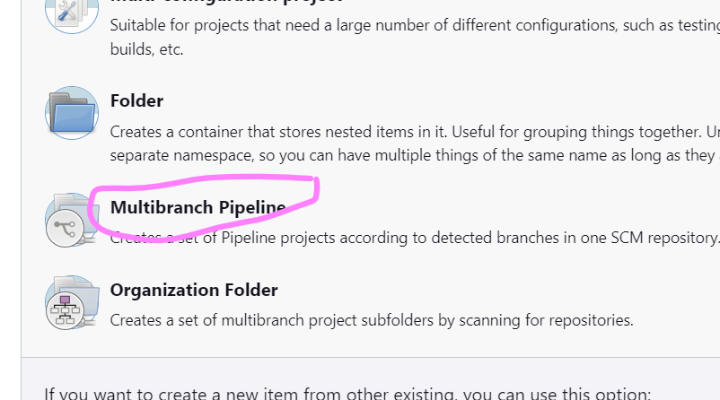
  * created two branches named develop and release
  * 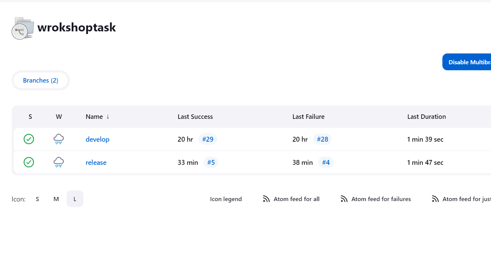
  * In develop branch i created a Jenkinsfile with the follwing content
  ```pipeline{
  agent {label'JDK-JDK'}
  stages{
    stage('vcs'){
      steps{
        git url: 'https://github.com/chaitanyasagile/spring-petclinic.git',
            branch: 'develop'
      }
    }
    stage('build') {
      steps{
        sh './mvnw package'
      }
    }
    stage(sonar) {
      steps{
        withSonarQubeEnv('sonar_cloud') {
         sh './mvnw clean package sonar:sonar -Dsonar.organization=suchi1 -Dsonar.projectKey=teju'
        } 
      }
    }
  }
}
  ```
  * 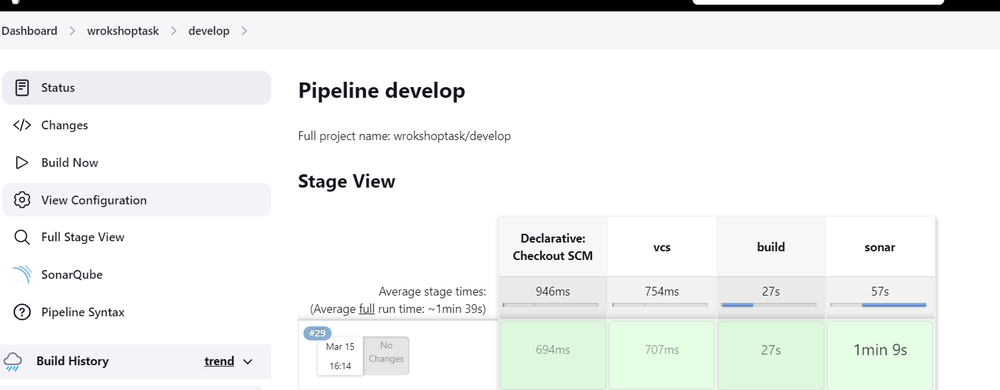
  * In release branch i created one Jenkinsfile and one servicefile named spc.service and also a ansibleplaybook named ansible.yml
  * In release branch the Jenkinsfile contains the following content
  ```pipeline{
  agent {label'JDK-JDK'}
  stages{
    stage('vcs'){
      steps{
        git url: 'https://github.com/chaitanyasagile/spring-petclinic.git',
            branch: 'release'
      }
    }
    stage('build') {
      steps{
        sh './mvnw package'
      }
    }
    stage(sonar) {
      steps{
        withSonarQubeEnv('sonar_cloud') {
         sh './mvnw clean package sonar:sonar -Dsonar.organization=suchi1 -Dsonar.projectKey=teju'
        } 
      }
    }
    stage(artifact) {
      steps{
        archiveArtifacts artifacts: '**/target/*.jar',
         fingerprint: true
      }
    }
    stage('copyingjarfile') {
      steps{
        sh 'sudo cp ${WORKSPACE}/target/spring-petclinic-3.0.0-SNAPSHOT.jar /tmp'
      }
    }
    stage('deploy') {
      steps{
        sh 'ansible-playbook -i host ansible.yml'
      }
    }
  }
}
  ```
  * service file contains following content
  ```[Unit]
Description=Foo

[Service]
ExecStart=/usr/lib/jvm/java-17-openjdk-amd64/bin/java -jar /tmp/spring-petclinic-3.0.0-SNAPSHOT.jar

[Install]
WantedBy=multi-user.target
  ```
  * Ansible playbook with the following content
  ```---
  - name: spcpipeline
    hosts: localhost
    become: yes
    tasks:
      - name: creating a servicefile
        ansible.builtin.copy:
          src: spc.service
          dest: /etc/systemd/system/spc.service
          mode: '664'
      - name: enableing servicefile
        ansible.builtin.systemd:
          name: spc.service
          enabled: yes
          daemon_reload: true
          state: "started"
  ```
  *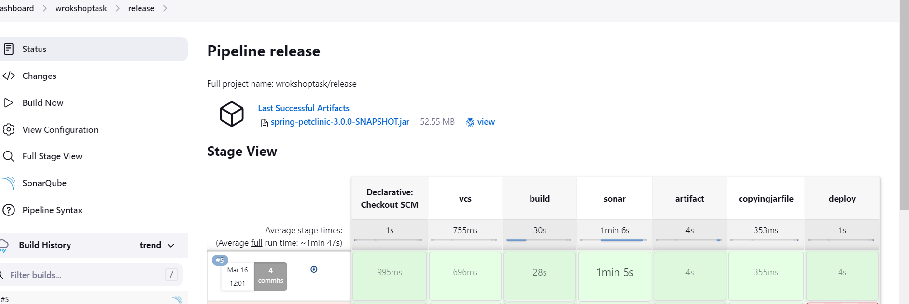 
  After the pipeline is built successfully we can see the springpetclinic page
  * <https://<publicadress:8080>>  
  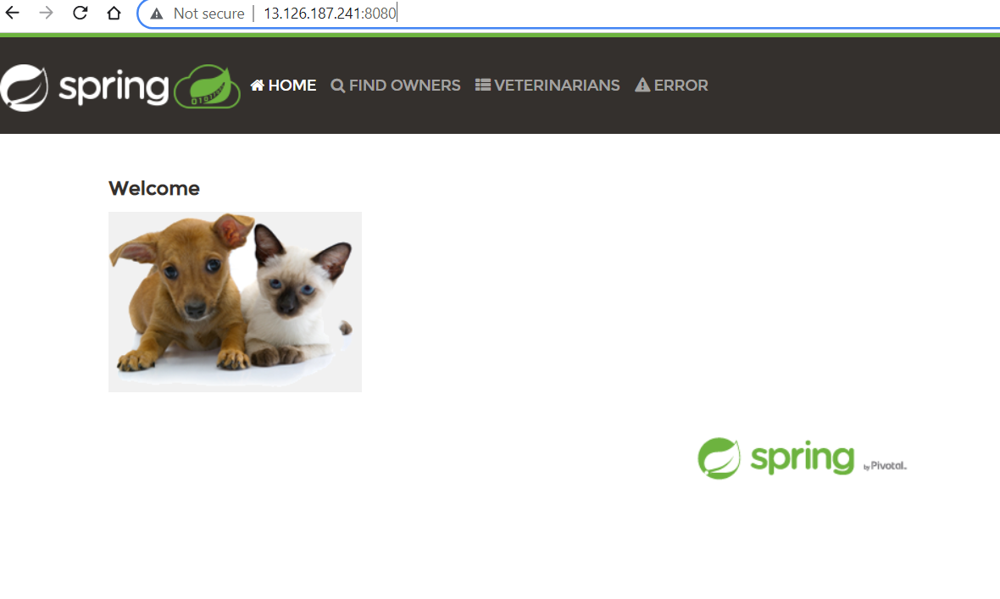
`## Create a jenkins job for merging pull requests into develop branch`
*  For creating this first i forked the project into my organization
*  After that in jenkins node i installed necessary plugin
*  For documentation of configuring plugin
  [referehere] (https://plugins.jenkins.io/ghprb/)
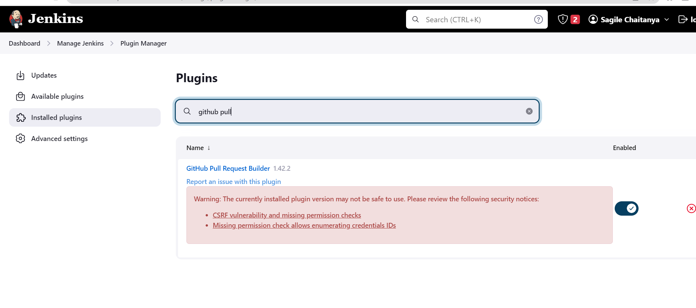 
* After that i generated a  personal access token in git
  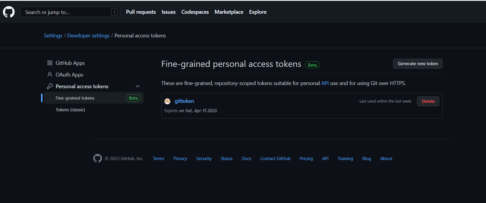 
  * for creating webhooks 
  * [referehere] (https://devopscube.com/jenkins-build-trigger-github-pull-request/#:~:text=Go%20to%20Github%20repository%20settings,the%20%E2%80%9CPull%20requests%E2%80%9D%20option.)
  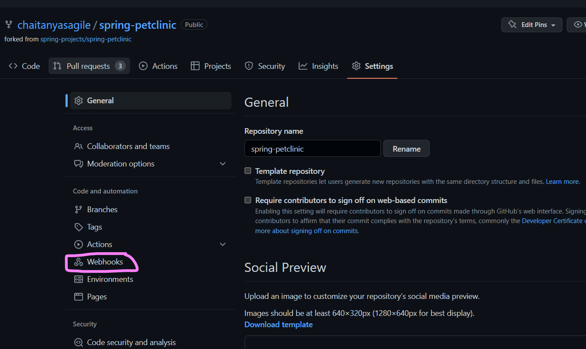
  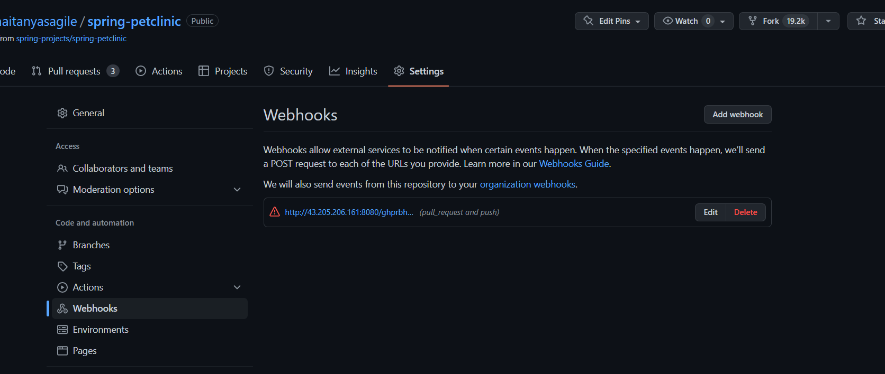
* congfiguring the GitHub Pull Request Builder 
  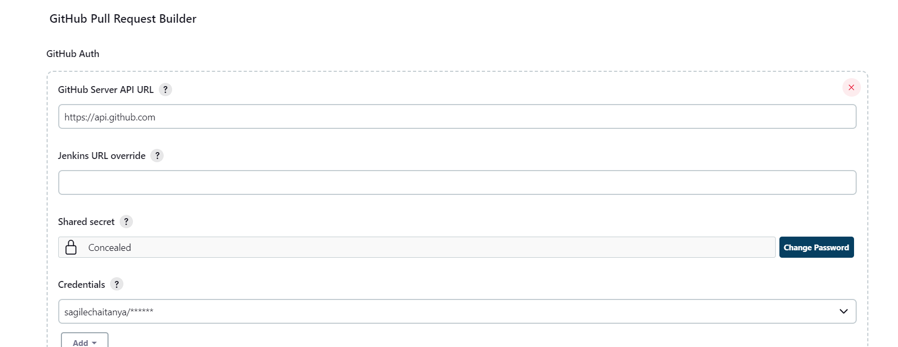
* Add Auto-manage webhooks box
  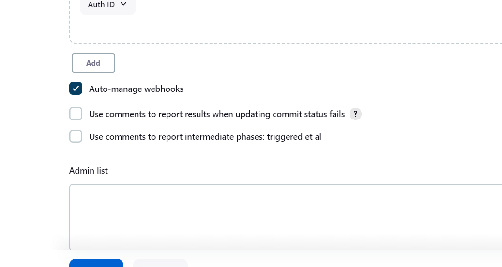
* Now create a freestyle project and open the congfigure 
  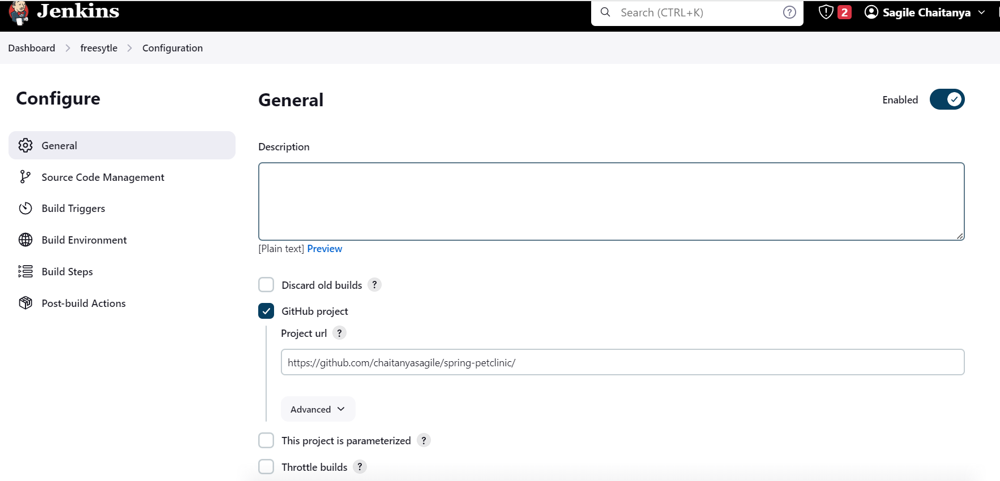
  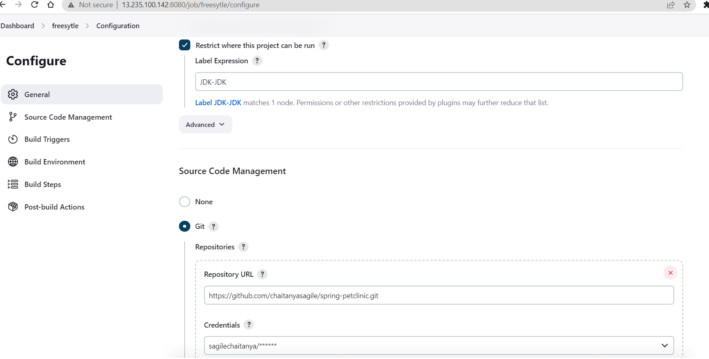
  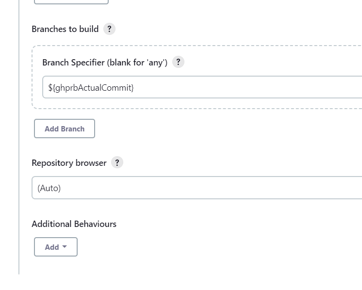
* after completing all the required sections click on save
  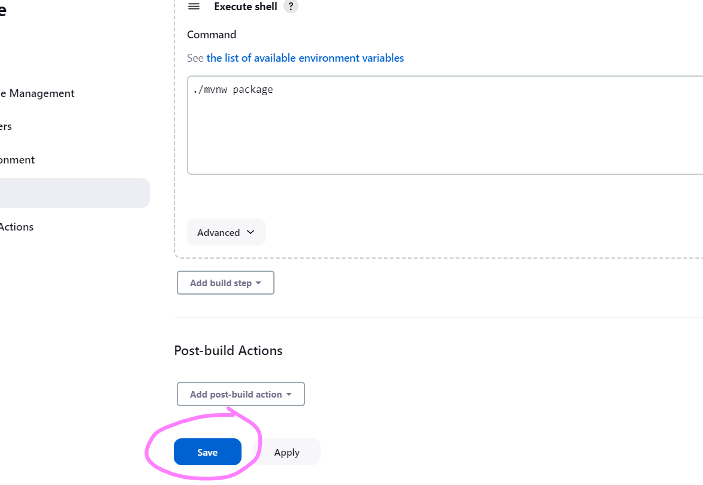
* final build
* 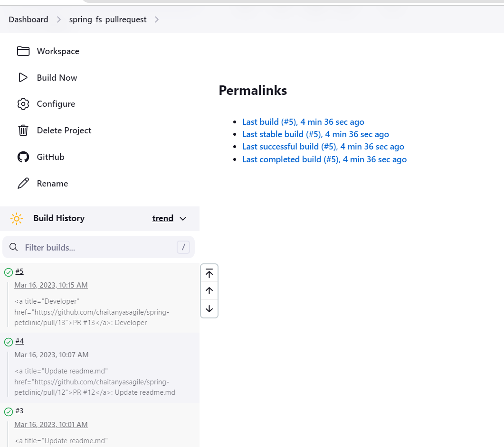


